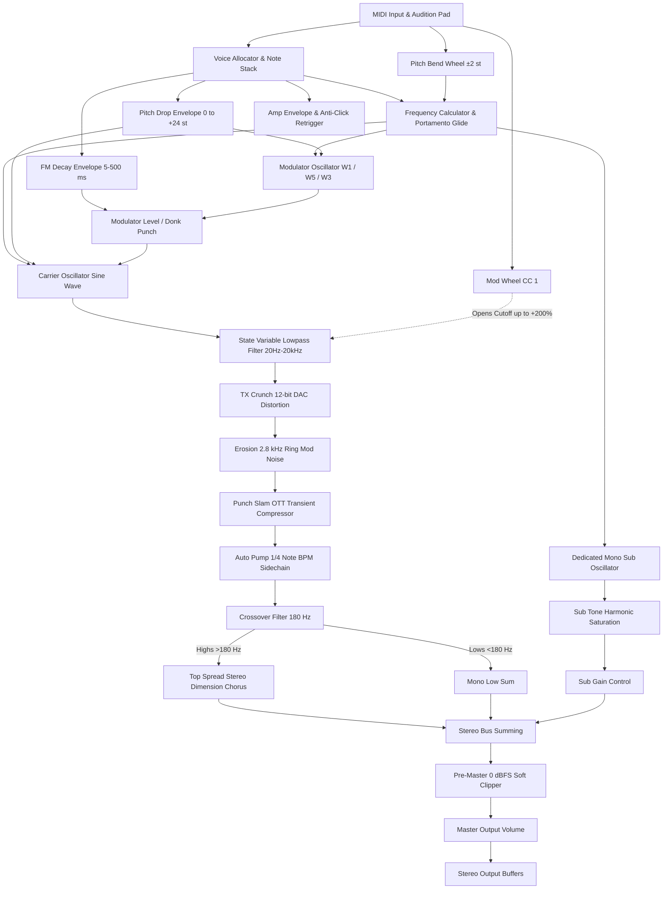

# 🏗️ DSP & Software Architecture — Extasis Donker

This document provides a detailed overview of the digital signal processing (DSP) pipeline, control routing, and software architecture of **Extasis Donker**.

---

## 1. High-Level Signal Flow Diagram

The following Mermaid diagram outlines the end-to-end signal chain from incoming MIDI messages to the stereo pre-master output:

---

## 2. DSP Modules Breakdown

### 2.1. DonkSynth (`Source/DSP/DonkSynth.h`)
The primary polyphonic/monophonic synthesis engine managing voice triggering, envelope generators, and parameter updates.
- **Retrigger Smoothing**: Checks if the previous note is still vibrating (`ampEnvelope.getCurrentLevel() < 0.05f`). If level is high, it avoids hard phase resets, preventing digital clicks on fast 1/16th and 1/32nd note retriggers.
- **Pitch Transient**: Implements an exponential semitone decay curve modeled as \( f(t) = f_0 \cdot 2^{(\Delta_{\text{pitch}} \cdot e^{-t/\tau}) / 12} \).

### 2.2. DonkOscillator (`Source/DSP/DonkOscillator.h`)
Implements the 2-operator phase-modulation algorithm modeled after the Yamaha TX81Z:
- **Waveform 1 (Sine)**: Standard \( \sin(\theta) \).
- **Waveform 5 (Half-Sine)**: \( \sin(\theta) \) for \( 0 \le \theta < \pi \), and \( 0 \) for \( \pi \le \theta < 2\pi \).
- **Waveform 3 (Rectified Sine)**: \( |\sin(\theta)| \).

### 2.3. SnappyEnvelope (`Source/DSP/SnappyEnvelope.h`)
High-precision exponential decay generator with analog-style curvature specifically calculated for ultra-tight percussive attacks.

### 2.4. StereoProcessor (`Source/DSP/StereoProcessor.h`)
Handles the non-linear distortion, spatial widening, and dynamics processing:
- **Erosion**: Generates a modulated sinusoidal carrier at 2.8 kHz multiplied by high-frequency white noise.
- **Top Spread**: A dual-delay modulated chorus matrix operating exclusively on the high-pass filtered signal (\( f_c = 180 \text{ Hz} \)).
- **Soft Clipper**: Cubic polynomial waveshaper \( y = x - \frac{1}{3}x^3 \) with soft knee transition into saturation.

---

## 3. License Manager (`Source/LicenseManager.h`)
Manages offline licensing via dual 64-bit cryptographic hashing. Validates keys matching `EXTD-XXXX-XXXX-XXXX-XXXX` with zero network access required.

---

## 4. GUI & Architecture Layers (`Source/GUI/`)
- **PluginProcessor (`Source/PluginProcessor.cpp`)**: JUCE audio processor interface managing APVTS (AudioProcessorValueTreeState), preset serialization (`.edpreset`), and 10-minute demo evaluation tracking.
- **PluginEditor (`Source/PluginEditor.cpp`)**: Dynamic resizable editor handling vector geometry, mouseover notifications, and coordinate scaling.
- **TX81ZDisplay (`Source/GUI/TX81ZDisplay.cpp`)**: Vector phosphor oscilloscope and dot-matrix typography display.
- **SavePresetOverlay (`Source/GUI/SavePresetOverlay.h`)**: Modal preset creation overlay ensuring reliable cross-DAW preset saving.
- **ActivationOverlay (`Source/GUI/ActivationOverlay.h`)**: Offline serial registration modal.
