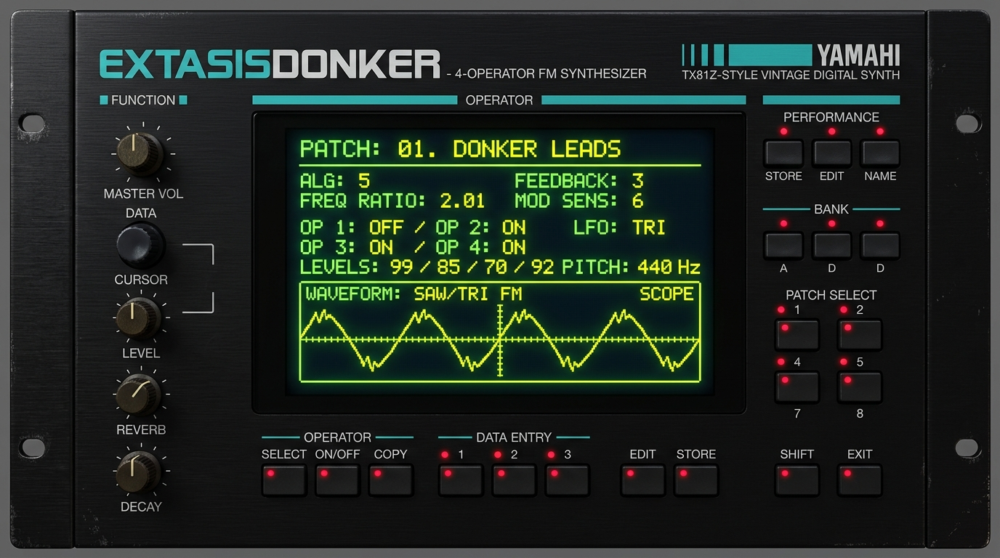

# ⚡ Extasis Donker (v1.0)

<p align="center">
  
</p>

<p align="center">
  <strong>Dedicated FM Donk & Guaracha Bass Synthesizer Plugin Workstation</strong><br>
  <em>Inspired by the legendary Yamaha TX81Z (1987), 90s House & Latin Club Culture. Built with JUCE (C++17) for macOS & Windows.</em>
</p>

<p align="center">
  
  
  
  
</p>

---

<p align="center">
  
</p>

---

[](https://github.com/laurorobles/ExtasisDonker/actions/workflows/build.yml)

## ✨ Overview

**Extasis Donker** is a precision-engineered virtual synthesizer designed exclusively for the creation and sculpting of the iconic **DONK** and **GUARACHA** bass sound (*LatelyBass*, *House Organ Bass*, *Guaracha Medallo Punch*, *Aleteo / Zapateo*, *Russian Hardbass*, *UK Bounce*, *Tech House Slap*).

Unlike generic 4/6-operator FM synths (which are notoriously tedious to program and easy to make sound dissonant), **Extasis Donker locks every parameter inside its mathematically calibrated "Sweet Spot"**. Every knob turn guarantees a punchy, snappy, club-ready bass that sits perfectly in the mix.

### 🌟 Key Highlights:
- **TX81Z-Modeled DSP Engine**: Pure Sine (`W1`), Yamaha Half-Sine (`W5`), and Full-Wave Rectified (`W3`) with continuous morphing.
- **Pitch Drop (Laser) Envelope**: Ultra-fast exponential pitch sweeps (0–24 semitones) for instant laser/thud percussive impact.
- **Auto Pump Sidechain**: Built-in, BPM-synced 1/4 note volume ducking effect to instantly achieve the Guaracha / Bounce groove.
- **Resonant Squelch Filter**: State-Variable Lowpass filter capable of going down to 50Hz for pure sub isolation, paired with a squelechy resonance control.
- **Pre-Master FX Suite**:
  - **`Erosion`**: 12-bit DAC quantization and 2.8 kHz noise ring-modulator for small-speaker presence.
  - **`Punch Slam`**: Transient compressor / OTT-style dynamic snap.
  - **`Soft Clip`**: Dedicated analog tape & diode clipper with strict 0 dBFS ceiling.
- **Mono-Locked Sub Bass**: Independent pure sine sub-oscillator with harmonic drive, strictly locked in mono to prevent club phase cancellation.
- **High-Band Top Spread**: Modulated stereo chorus and dimension applied exclusively to frequencies **>180 Hz**.
- **Retro TX81Z LCD Display**: 80s neon green & yellow dot-matrix calculator display with real-time vector phosphor oscilloscope.
- **Extasis Logo Audition Pad**: Integrated tactile audition pad with real-time vertical drag pitch transposition ($\pm 12$ semitones).
- **Full MIDI CC & Live Value Feedback**: Real-time numeric values displayed directly below every knob and mapped to standard MIDI CCs.
- **30 Factory Presets**: Spanning Classic 90s House, Colombian Guaracha/Aleteo, UK Bounce, Russian Hardbass, and Modern Tech House.

---

## 📖 Official Documentation & Manual

For full technical specifications, preset sound design breakdowns, and parameter reference, see the **[Official User Manual (MANUAL.md)](MANUAL.md)** and **[Technical Architecture (TECHNICAL.md)](TECHNICAL.md)**.

---

## 📥 Download Pre-Compiled Binaries

Official pre-compiled installers (**VST3**, **AU**, and **Standalone**) are available for macOS (Apple Silicon & Intel) and Windows (x64):

- **Releases & Builds**: Check the **[GitHub Releases](https://github.com/laurorobles/ExtasisDonker/releases)** or **[GitHub Actions](https://github.com/laurorobles/ExtasisDonker/actions)** tab.
- **Official Store & Music**: [extasisrecords.bandcamp.com](https://extasisrecords.bandcamp.com)

---

## 🛠️ Building from Source

### Prerequisites:
- **CMake 3.15+**
- **C++17 Compiler**: Xcode Clang (macOS) or Visual Studio 2022 / MSVC (Windows)
- **JUCE Framework** (included / configured via CMake)

### Build Instructions:

```bash
# 1. Clone the repository
git clone https://github.com/laurorobles/ExtasisDonker.git
cd ExtasisDonker

# 2. Configure with CMake
cmake -B build -S .

# 3. Build VST3, AU, and Standalone targets
cmake --build build --config Release --parallel
```

### Automated Installation:
Run the included automated installer script for your OS:
- **macOS**: Double-click `installer/INSTALL_MAC.command` or run `./scripts/install.sh`
- **Windows**: Double-click `installer/INSTALL_WINDOWS.bat`

---

## 🔑 License Activation & Support

Extasis Donker features an offline cryptographic license verification system. 
Upon purchase from our official store or partner marketplaces, you will receive your personal 20-character license key (`EXTD-XXXX-XXXX-XXXX-XXXX`) to unlock full permanent access.

- **Official Store**: [extasisrecords.bandcamp.com](https://extasisrecords.bandcamp.com)
- **Support & Inquiries**: Contact through Extasis Records Bandcamp.

---

## 👥 Credits & Contact

- **DSP Architecture & Development**: Lauro Robles (`@laurorobles`)
- **Label & Releases**: [Extasis Records](https://extasisrecords.bandcamp.com)


> **Licencias:** Consigue tu licencia oficial en [http://laurorobles.gumroad.com](http://laurorobles.gumroad.com)
