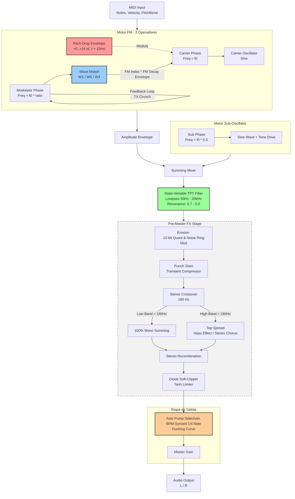

# EXTASIS DONKER - Documentación Técnica y Arquitectura DSP ⚙️

## 1. Arquitectura del Flujo de Señal (Signal Flow)

A continuación se detalla el ruteo de la señal de audio y modulaciones (DSP Architecture), desde la entrada MIDI hasta la salida de audio estéreo.

---

## 2. Modelado Matemático de Formas de Onda TX81Z

### 1. Onda W1 (Standard Sine)
\[ f_{W1}(\theta) = \sin(\theta) \]

### 2. Onda W5 (Yamaha Half-Sine)
Utilizada en el operador modulador del preset C15 *LatelyBass*:
\[ f_{W5}(\theta) = \begin{cases} \sin(\theta) & \text{si } \sin(\theta) > 0 \\ 0 & \text{si } \sin(\theta) \le 0 \end{cases} \]
*Nota de implementación:* Se compensa el desplazamiento de continua mediante escala dinámica \(2.0 \cdot f_{W5}(\theta) - 0.5\).

### 3. Onda W3 (Full-Wave Rectified)
\[ f_{W3}(\theta) = |\sin(\theta)| \]

---

## 3. Algoritmo de Modulación de Fase con Realimentación

Para el modulador con feedback:
\[ \theta_{mod}[n] = (\theta_{mod}[n-1] + \Delta\theta_{mod} + \beta \cdot y_{mod}[n-1]) \pmod{2\pi} \]
\[ y_{mod}[n] = \text{WaveMorph}(\theta_{mod}[n]) \]

Para la portadora:
\[ \theta_{car}[n] = (\theta_{car}[n-1] + \Delta\theta_{car}) \pmod{2\pi} \]
\[ y_{car}[n] = \sin\left(\theta_{car}[n] + I_{FM}[n] \cdot y_{mod}[n]\right) \]
Donde \(I_{FM}[n] = \text{FmAmount} \cdot \text{Env}_{FM}[n] \cdot 8.0\).

---

## 4. Ruteo de Ducking (Auto Pump Sidechain)

El Auto Pump extrae el tempo del DAW (BPM) y la posición del Playhead (PPQ) y aplica la siguiente atenuación no lineal sincronizada por sample:
\[ \text{frac} = \text{PPQ}_{n} - \lfloor \text{PPQ}_{n} \rfloor \]
\[ \text{DuckCurve}(\text{frac}) = 1.0 - (1.0 - \text{frac})^3 \]
\[ \text{Output}[n] = \text{Input}[n] \cdot \left[ (1.0 - \text{PumpAmt}) + (\text{PumpAmt} \cdot \text{DuckCurve}(\text{frac})) \right] \]

---

## 5. Curva del Soft-Clipper

La función de recorte suave analógico utiliza un umbral \(T = 0.7\):
\[ \text{SoftClip}(x) = \begin{cases} x & \text{si } |x| < T \\ \text{sgn}(x) \left[ T + (1 - T) \tanh\left( \frac{|x| - T}{1 - T} \right) \right] & \text{si } |x| \ge T \end{cases} \]
Esta curva garantiza que la señal nunca sobrepase \(\pm 1.0\) (0 dBFS) y genera una distorsión armónica suave de saturación musical.

---

## 6. Estructura de Clases C++

- `PluginProcessor` / `PluginEditor`: Gestión de parámetros APVTS, UI (JUCE) y sistema de Activación de Licencia.
- `DSP/DonkSynth.h`: Coordinador de voz monofónica legato, Auto Pump (Sidechain) sincrónico a PPQ y filtro TPT.
- `DSP/DonkOscillator.h`: Generadores de fase FM con formas de onda (W1, W3, W5) y sub-oscilador con drive.
- `DSP/SnappyEnvelope.h`: Envolventes ultra rápidas (Pitch Drop de 12ms y FM Decay de 5ms a 500ms).
- `DSP/StereoProcessor.h`: Erosion (12-bit), Punch Slam, Soft Clipper y Crossover de 180Hz (Mono-Lock & Spread).
- `LicenseManager.h`: Validación criptográfica offline de la llave `EXTD-XXXX-XXXX-XXXX-XXXX`.

> **Licencias:** Consigue tu licencia oficial en [http://laurorobles.gumroad.com](http://laurorobles.gumroad.com)
